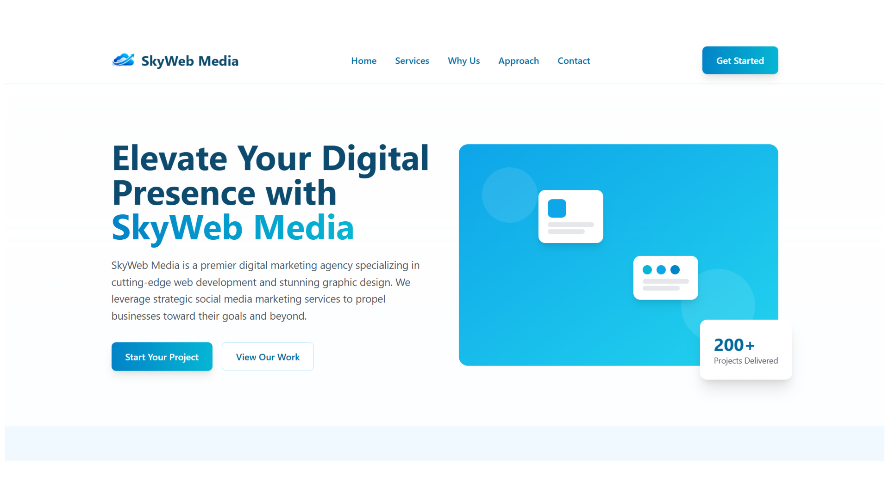
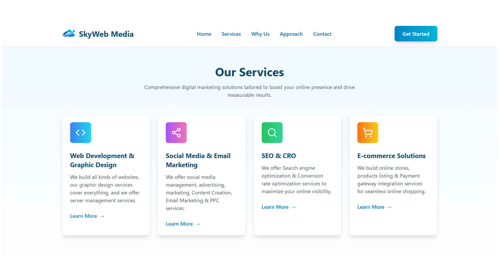
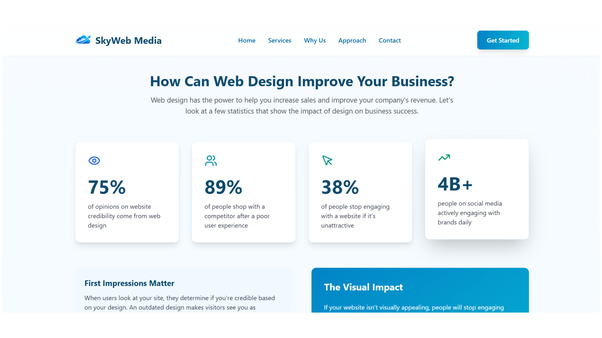
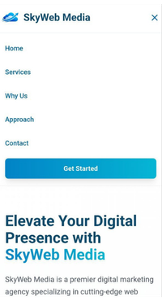
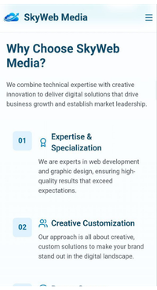
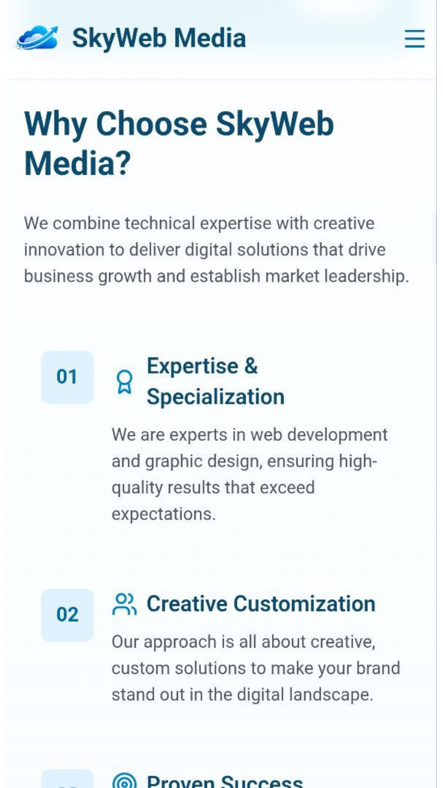
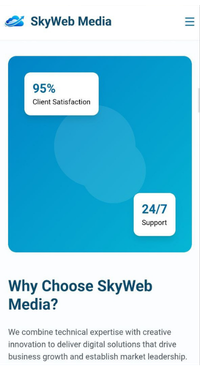

# SkyWeb Mediasd

## 🌟 Live Project

**Agency Website:** [https://sky-web-media.vercel.app/](https://sky-web-media.vercel.app/)

## Overview
SkyWeb Media is a personal, real-world project created by me, representing a digital marketing agency website and showcases the agency's services.

### 📸 Screenshots









## Tech Stack
- **Frontend:** React 18 + TypeScript
- **Build Tool:** Vite
- **Styling:** Tailwind CSS + custom CSS utilities
- **Icons:** Lucide React, React Icons
- **Linting:** ESLint
- **Deployment Target:** Vercel

## Implemented Sections
- Sticky responsive navbar
- Hero section with CTA and stats card
- Services section
- Why Choose Us section
- Marketing Funnel section
- Statistics section
- SMMA section
- Footer with contact information, newsletter UI, and creator attribution link

## Best Practices Implemented

### 1) SEO
- Descriptive page title and meta description in `index.html`
- `robots` meta tag for indexing and preview behavior
- Open Graph tags for social sharing (`og:title`, `og:description`, `og:image`, etc.)
- Twitter Card metadata
- Structured data (JSON-LD) using `Organization` schema
- `sitemap.xml` included in `public/`
- `robots.txt` included in `public/`

### 2) Security
- Content Security Policy (CSP) added via meta tag in `index.html`
- `X-Content-Type-Options: nosniff` via meta
- Strict referrer policy (`strict-origin-when-cross-origin`)
- External attribution link in footer uses `target="_blank"` + `rel="noopener noreferrer"`
- `frame-ancestors 'none'` and restrictive CSP directives to reduce clickjacking/injection surface

### 3) Performance
- Vite production build and optimized static bundle output
- SPA deployed as static assets from `dist/`
- Manifest file (`site.webmanifest`) included for better installability and metadata
- Lightweight component architecture and reusable UI sections

### 4) Responsiveness & UX
- Mobile-first layout with Tailwind utility classes
- Hero stats card responsiveness fix for phone view (card no longer clips on small screens)
- Consistent spacing and adaptive grid layout across sections

### 5) Code Quality
- TypeScript strict mode enabled
- ESLint configured for code quality checks
- `@types/node` added to satisfy `tsconfig.node.json` and tooling type requirements

## Project Structure
```text
skyweb-media/
├─ public/
│  ├─ favicon.png
│  ├─ logo.png
│  ├─ robots.txt
│  ├─ sitemap.xml
│  ├─ site.webmanifest
│  └─ vite.svg
├─ src/
│  ├─ assets/
│  ├─ components/
│  │  ├─ Footer.tsx
│  │  ├─ Hero.tsx
│  │  ├─ MarketingFunnel.tsx
│  │  ├─ Navbar.tsx
│  │  ├─ Services.tsx
│  │  ├─ SMMA.tsx
│  │  ├─ Statistics.tsx
│  │  └─ WhyChooseUs.tsx
│  ├─ types/
│  │  └─ index.ts
│  ├─ App.tsx
│  ├─ App.css
│  ├─ index.css
│  └─ main.tsx
├─ index.html
├─ vercel.json
├─ package.json
├─ tailwind.config.js
├─ postcss.config.js
├─ vite.config.ts
├─ tsconfig.json
├─ tsconfig.app.json
├─ tsconfig.node.json
└─ eslint.config.js
```

## 📄 License

Copyright (c) 2026 SkyWeb Media. All rights reserved.
This project is private and proprietary to SkyWeb Media. No part of this project may be copied, modified, or redistributed for any commercial or personal use without the express written permission of the author.


- **Accessibility Checks** - WCAG compliance validation


## Author
Created and maintained by **Alaa Younsi**.
